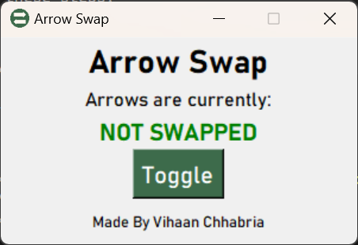

# Arrow Swap



Arrow Swap lets you toggle swapping your keyboard arrow keys for easy customized navigation. This is originally made for switching keys to control a CNC that it facing in a opposite direction.

## Usage

### Installation
To install Arrow Swap, download the installer from [here](https://github.com/VihaanChhabria/ArrowSwap/releases/tag/v1.0.0).

### Running Locally
To run Arrow Swap locally, follow these steps:
1. Clone the repository:
    ```bash
    git clone https://github.com/yourusername/ArrowSwap.git
    ```
2. Navigate to the project directory:
    ```bash
    cd ArrowSwap
    ```
3. Install the required dependencies:
    ```bash
    pip install -r requirements.txt
    ```
4. Start the application:
    ```bash
    python main.py
    ```